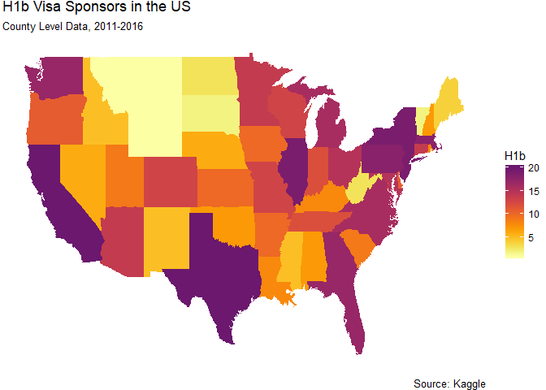
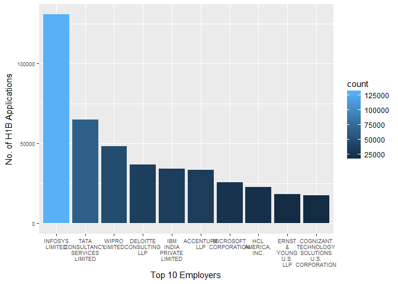

<h1 align="center">H1b Sponsor Accross US</h1>
<h3 align="center">Lei Duan,Qingqing Long,Xiaochen Li,Nehal</h3>
<h4 align="center">November 6, 2017</h4>

Part I: Introduction
====================

Objective
---------

The H-1B is an employment-based, non-immigrant visa category for temporary foreign workers in the United States. As our team consists of 4 international students, we would like to understand the overall distribution of H1-B visa sponsorship opportunities in US in order to target companies that tend to offer more H1B visas for international employees.

Data resource
-------------

From Kaggle: <https://www.kaggle.com/nsharan/h-1b-visa#>
Dimension: 3002458 obersavtions 12 features

Part II: Data preparation
=========================

-   Determine No. of NAs
-   Adjust messy looking data for clear visualization
-   Attach external data(for mapping)

``` r
library(readxl)
library(ggplot2)
library(tidyverse)
library(OIdata)
library(ggmap)
library(stringr)
library(viridis)

# load dataset
h1b <- readRDS("data/h1b_kaggle.rds")

# Determine No. of NAs
sum(is.na(h1b)) # 232,426 NAs in total

# get R to display unscientific notation in ggplot
options(scipen = 10000)

# Add line break in EMPLOYER_NAME to avoid messy looking in plot
levels(h1b$EMPLOYER_NAME) <- gsub(" ", "\n", levels(h1b$EMPLOYER_NAME))

## Split WORKSITE in to city and state
h1b <- separate(h1b,WORKSITE, into = c("subregion","region"), sep = ",")
h1b$region <- tolower(h1b$region) %>% str_trim()
h1b$subregion <- tolower(h1b$subregion) %>% str_trim()
```

PART III: Data visualization
============================

Plot 1: No. of h1b applications submitted from 2011 to 2016
-----------------------------------------------------------

``` r
# Plot 1: No. of h1b applications submitted from 2011 to 2016
h1b %>% 
  group_by(YEAR) %>% 
  summarise(count = n()) %>% 
  ggplot() + geom_bar(aes(YEAR, count), stat = "identity") + ylab("No. of H1B Applications")
```


**The number of H1B applications have increased throughout the year from 2011 to 2016.**

Plot 2: H1b Visa Sponsored distribution accross US by year
----------------------------------------------------------

``` r
# Plot 2: H1b Visa Sponsored distribution accross US by year
h1b_region <- h1b %>%
  group_by(region) %>% 
  summarize(count = n()) %>% 
  mutate(count_range = ntile(count, 20))

h1b_region_year <- h1b %>%
  filter(!is.na(YEAR)) %>% 
  group_by(region,YEAR) %>% 
  summarize(count = n())

h1b_regionmap <- h1b_region %>% 
  inner_join(map_data("state"),by = "region")

h1b_regionmap_year <- h1b_region_year %>% 
  inner_join(map_data("state"),by = "region")

ggplot(h1b_regionmap_year, aes(long, lat, group = group)) +
  geom_polygon(aes(fill = count)) +
  scale_fill_viridis(discrete = F,name = "H1b",option = "B",begin = 1, end = 0.3) +
  facet_wrap(~ YEAR) +
  theme_void() + labs(title = "H1b Visa Sponsors in the US",
     subtitle = "County Level Data, 2011-2016",
     caption = "Source: Kaggle")
```


**From 2011-2016, CA and TX are the most significantly growing states in terms of H1B sponsor opportunity.**

Plot 3: H1b Visa Sponsored distribution accross US
--------------------------------------------------

``` r
# Plot 3: H1b Visa Sponsored distribution accross US
ggplot(h1b_regionmap, aes(long, lat, group = group)) +
  geom_polygon(aes(fill = count_range)) +
  scale_fill_viridis(discrete = F,name="H1b",option = "B",begin = 1, end = 0.3) +
  theme_void() +labs(title = "H1b Visa Sponsors in the US",
                     subtitle = "County Level Data, 2011-2016",
                     caption = "Source: Kaggle")
```



**From Year 2011 to 2016, CA,TX an NY offer the most H1B visa sponsor opportunities among the states.** **They are the most popular places for international students to land a job.**

Plot 4: top 10 employers in sponsoring h1b visas from 2011 to 2016
------------------------------------------------------------------

``` r
# Plot 4: top 10 employers in sponsoring h1b visas from 2011 to 2016
h1b %>% 
  group_by(EMPLOYER_NAME) %>% 
  summarize(count = n()) %>% 
  arrange(desc(count)) %>% 
  head(10) %>% 
  ggplot() + 
  geom_bar(aes(x = reorder(EMPLOYER_NAME, -count), y = count), stat = "identity") +
  xlab("Top 10 Employers") + ylab("No. of H1B Applications") +
  theme(axis.text = element_text(size = 7))
```



**The top 10 companies submitting the most H1B applications are: Infosys, Tata consultancy, Wipro, Delotte, IBM,Accenture, Microsoft, HCL, Ernst & Young, Cognizant technology solutions.**

Plot 5: top 10 employers in sponsoring h1b application for Fulltime positions
-----------------------------------------------------------------------------

``` r
# Plot 5: top 10 employers in sponsoring h1b application for Fulltime positions
h1b %>% 
  group_by(EMPLOYER_NAME) %>% 
  summarize(count = n()) %>% 
  arrange(desc(count)) %>% 
  head(10) %>% 
  inner_join(h1b, by = "EMPLOYER_NAME") %>% 
  group_by(EMPLOYER_NAME, FULL_TIME_POSITION) %>% 
  summarise(count = n()) %>% 
  ggplot() + 
  geom_bar(aes(x = reorder(EMPLOYER_NAME, -count), y = count, fill = FULL_TIME_POSITION), stat = "identity") +
  xlab("Top 10 Employers") + ylab("No. of H1B Applications") + theme(axis.text = element_text(size = 7))
```


**Among the top 10 companies that submitted h1b applications, the majority of applications are for full-time positions.**
